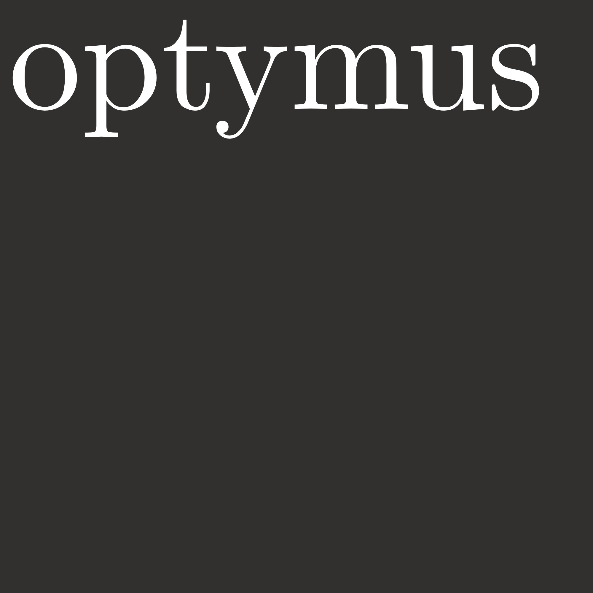

<h1 align="center">

</h1>

Welcome to _optymus_, the Optimization Methods Library for Python! This library provides a comprehensive collection of optimization methods, both with and without constraints, implemented in the Python programming language.

## Table of Contents

- [Introduction](#introduction)
- [Getting Started](#getting-started)
- [Content](#content)
- [Contributions](#contributions)
- [License](#license)

## Introduction

_optymus_ is designed to empower users with a versatile set of optimization tools, facilitating the search for optimal solutions in various problem domains. This library covers a range of optimization methods, making it suitable for diverse applications in computer science and engineering.

## Getting Started

To begin using Optymus, follow these steps:

1. **Install optymus:**
   ```bash
   pip install optymus
   ```

2. **Explore the Documentation:**
   Visit the [official documentation](https://optymus-docs.readthe.com) to understand the available optimization methods and how to use them effectively.

3. **Try Examples:**
   Explore the `examples` directory in the Optymus repository to find sample code snippets and usage demonstrations.

## Content

Optymus includes a rich set of optimization methods, such as:

- Unconstrained Optimization Methods
- Constrained Optimization Methods
- Global Optimization
- Gradient Descent
- Evolutionary Algorithms

Refer to the documentation for detailed information on each method and its application.

## Contributions

Contributions to Optymus are highly appreciated! If you have additional optimization methods, improvements, or bug fixes, please submit a pull request following the [contribution guidelines](CONTRIBUTING.md).

## License

Optymus is licensed under the [MIT License](LICENSE), allowing you to use, modify, and distribute the library for both commercial and non-commercial purposes.

Start optimizing with Optymus and unlock the potential for finding optimal solutions in your Python projects!