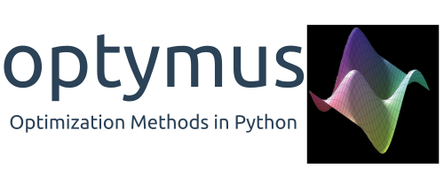

.. optymus documentation master file, created by
   sphinx-quickstart on Tue Jan  2 19:22:45 2024.
   You can adapt this file completely to your liking, but it should at least
   contain the root `toctree` directive.

.. image:: https://img.shields.io/pypi/v/optymus
.. image:: https://img.shields.io/github/license/quant-sci/optymus
.. image:: https://readthedocs.org/projects/optymus/badge/?version=latest
.. image:: https://img.shields.io/pypi/dm/optymus.svg?label=PyPI%20downloads
.. image:: https://img.shields.io/badge/JAX-Accelerated-9cf.svg?style=flat-square&logo=data:image/png;base64,iVBORw0KGgoAAAANSUhEUgAAAC0AAAAaCAYAAAAjZdWPAAAIx0lEQVR42rWWBVQbWxOAkefur%2B7u3les7u7F3ZIQ3N2tbng8aXFC0uAuKf2hmlJ3AapIgobMv7t0w%2Ba50JzzJdlhlvNldubeq%2FY%2BXrTS1z%2B6sttrKfQOOY4ns13ecFImb47pVvIkukNe4y3Junr1kSZ%2Bb3Na248tx7rKiHlPo6Ryse%2F11NKQuk%2FV3tfL52yHtXm8TGYS1wk4J093wrPQPngRJH9HH1x2fAjMhcIeIaXKQCmd2Gn7IqSvG83BueT0CMkTyESUqm3vRRggTdOBIb1HFDaNl8Gdg91AFGkO7QXe8gJInpoDjEXC9gbhtWH3rjZ%2F9yK6t42Y9zyiC1iLhZA8JQe4eqKXklrJF0MqfPv2bc2wzPZjpnEyMEVlEZCKQzYCJhE8QEtIL1RaXEVFEGmEaTn96VuLDzWflLFbgvqUec3BPVBmeBnNwUiakq1I31UcPaTSR8%2B1LnditsscaB2A48K6D9SoZDD2O6bELvA0JGhl4zIYZzcWtD%2BMfdvdHNsDOHciXwBPN18lj7sy79qQCTNK3nxBZXakqbZFO2jHskA7zBs%2BJhmDmr0RhoadIZjYxKIVHpCZngPMZUKoQKrfEoz1PfZZdKAe2CvP4XnYE8k2LLMdMumwrLaNlomyVqK0UdwN%2BD7AAz73dYBpPg6gPiCN8TXFHCI2s7AWYesJgTabD%2FS5uXDTuwVaAvvghncTdk1DYGkL0daAs%2BsLiutLrn0%2BRMNXpunC7mgkCpshfbw4OhrUvMkYo%2F0c4XtHS1waY4mlG6To8oG1TKjs78xV5fAkSgqcZSL0GoszfxEAW0fUludRNWlIhGsljzVjctr8rJOkCpskKaDYIlgkVoCmF0kp%2FbW%2FU%2F%2B8QNdXPztbAc4kFxIEmNGwKuI9y5gnBMH%2BakiZxlfGaLP48kyj4qPFkeIPh0Q6lt861zZF%2BgBpDcAxT3gEOjGxMDLQRSn9XaDzPWdOstkEN7uez6jmgLOYilR7NkFwLh%2B4G0SQMnMwRp8jaCrwEs8eEmFW2VsNd07HQdP4TgWxNTYcFcKHPhRYFOWLfJJBE5FefTQsWiKRaOw6FBr6ob1RP3EoqdbHsWFDwAYvaVI28DaK8AHs51tU%2BA3Z8CUXvZ1jnSR7SRS2SnwKw4O8B1rCjwrjgt1gSrjXnWhBxjD0Hidm4vfj3e3riUP5PcUCYlZxsYFDK41XnLlUANwVeeILFde%2BGKLhk3zgyZNeQjcSHPMEKSyPPQKfIcKfIqCf8yN95MGZZ1bj98WJ%2BOorQzxsPqcYdX9orw8420jBQNfJVVmTOStEUqFz5dq%2F2tHUY3LbjMh0qYxCwCGxRep8%2FK4ZnldzuUkjJLPDhkzrUFBoHYBjk3odtNMYoJVGx9BG2JTNVehksmRaGUwMbYQITk3Xw9gOxbNoGaA8RWjwuQdsXdGvpdty7Su2%2Fqn0qbzWsXYp0nqVpet0O6zzugva1MZHUdwHk9G8aH7raHua9AIxzzjxDaw4w4cpvEQlM84kwdI0hkpsPpcOtUeaVM8hQT2Qtb4ckUbaYw4fXzGAqSVEd8CGpqamj%2F9Q2pPX7miW0NlHlDE81AxLSI2wyK6xf6vfrcgEwb0PAtPaHM1%2BNXzGXAlMRcUIrMpiE6%2Bxv0cyxSrC6FmjzvkWJE3OxpY%2BzmpsANFBxK6RuIJvXe7bUHNd4zfCwvPPh9unSO%2BbIL2JY53QDqvdbsEi2%2BuwEEHPsfFRdOqjHcjTaCLmWdBewtKzHEwKZynSGgtTaSqx7dwMeBLRhR1LETDhu76vgTFfMLi8zc8F7hoRPpAYjAWCp0Jy5dzfSEfltGU6M9oVCIATnPoGKImDUJNfK0JS37QTc9yY7eDKzIX5wR4wN8RTya4jETAvZDCmFeEPwhNXoOlQt5JnRzqhxLZBpY%2BT5mZD3M4MfLnDW6U%2Fy6jkaDXtysDm8vjxY%2FXYnLebkelXaQtSSge2IhBj9kjMLF41duDUNRiDLHEzfaigsoxRzWG6B0kZ2%2BoRA3dD2lRa44ZrM%2FBW5ANziVApGLaKCYucXOCEdhoew5Y%2Btu65VwJqxUC1j4lav6UwpIJfnRswQUIMawPSr2LGp6WwLDYJ2TwoMNbf6Tdni%2FEuNvAdEvuUZAwFERLVXg7pg9xt1djZgqV7DmuHFGQI9Sje2A9dR%2FFDd0osztIRYnln1hdW1dff%2B1gtNLN1u0ViZy9BBlu%2BzBNUK%2BrIaP9Nla2TG%2BETHwq2kXzmS4XxXmSVan9KMYUprrbgFJqCndyIw9fgdh8dMvzIiW0sngbxoGlniN6LffruTEIGE9khBw5T2FDmWlTYqrnEPa7aF%2FYYcPYiUE48Ul5jhP82tj%2FiESyJilCeLdQRpod6No3xJNNHeZBpOBsiAzm5rg2dBZYSyH9Hob0EOFqqh3vWOuHbFR5eXcORp4OzwTUA4rUzVfJ4q%2FIa1GzCrzjOMxQr5uqLAWUOwgaHOphrgF0r2epYh%2FytdjBmUAurfM6CxruT3Ee%2BDv2%2FHAwK4RUIPskqK%2Fw4%2FR1F1bWfHjbNiXcYl6RwGJcMOMdXZaEVxCutSN1SGLMx3JfzCdlU8THZFFC%2BJJuB2964wSGdmq3I2FEcpWYVfHm4jmXd%2BRn7agFn9oFaWGYhBmJs5v5a0LZUjc3Sr4Ep%2FmFYlX8OdLlFYidM%2B731v7Ly4lfu85l3SSMTAcd5Bg2Sl%2FIHBm3RuacVx%2BrHpFcWjxztavOcOBcTnUhwekkGlsfWEt2%2FkHflB7WqKomGvs9F62l7a%2BRKQQQtRBD9VIlZiLEfRBRfQEmDb32cFQcSjznUP3um%2FkcbV%2BjmNEvqhOQuonjoQh7QF%2BbK811rduN5G6ICLD%2BnmPbi0ur2hrDLKhQYiwRdQrvKjcp%2F%2BL%2BnTz%2Fa4FgvmakvluPMMxbL15Dq5MTYAhOxXM%2FmvEpsoWmtfP9RxnkAIAr%2F5pVxqPxH93msKodRSXIct2l0OU0%2FL4eY506L%2B3GyJ6UMEZfjjCDbysNcWWmFweJP0Jz%2FA0g2gk80pGkYAAAAAElFTkSuQmCC

`optymus` is a Python library designed to address optimization problems in science and engineering. Built on `JAX <https://jax.readthedocs.io/en/latest/index.html>`_, allowing automatic differentiation for efficient computation of gradients and Hessians. The library emphasizes ease of use and flexibility, enabling users to solve optimization problems with minimal setup. optymus also provides robust capabilities for visualization and benchmarking, allowing users to gain insights into method behavior and compare performance effectively.

Features
--------

.. dropdown:: Optimization Methods
   :icon: rocket

   **Continuous optimization**

      **Zero-order**
         - Univariate
         - Powell's method

      **First-order**
         - Steepest Descent
         - Conjugate Gradient
         - BFGS

      **Second-order**
         - Newton's method
      
      **Adaptative learning**
         - Adam
         - Adamax
         - RMSprop
         - Adagrad
         - Yogi

.. dropdown:: Benchmark Functions
   :icon: ellipsis

   We provide a set of benchmark functions to test the optimization methods. The following functions are available:

      - Ackley
      - Beale
      - Booth
      - CrossInTray
      - Easom
      - Eggholder
      - GoldsteinPrice
      - Mccormick
      - Rastrigin
      - Rosenbrock
      - StyblinskiTang

   **Obs.:** You can also create your own benchmark function by inheriting the `CustomFunction` class.

.. dropdown:: Visualization
   :icon: eye

   **Plotting**
      - Plot the optimization path
      - Counter plot of the function

   **Reports**
      - Create a report with the optimization results

Getting Started
---------------

To begin using `optymus`, follow these steps:

1. **Install the package:**

.. code-block:: bash

   pip install optymus

2. **Create an optimization problem:**

.. code-block:: python

   from optymus import Optimizer
   from optymus.benchmark import MccormickFunction
   
   import numpy as np

   f = MccormickFunction()
   initial_point = np.array([2, 2])

3. **Optimize the problem:**

.. code-block:: python

   opt = Optimizer(f_obj=f,
                   x0=initial_point,
                   method='bfgs')

4. **Print the optimization report:**

.. code-block:: python

   opt.print_report()

Contributions
-------------

Contributions to Optymus are highly appreciated. If you have additional optimization methods, improvements, or bug fixes, please submit a pull request following the CONTRIBUTING.md on GitHub.

How to cite
-------------

If you use `optymus` in your research, please consider citing the library using the following BibTeX entry:

.. code-block:: bibtex
   
   @misc{optymus2024,
   author = {da Costa, Kleyton and Menezes, Ivan and Lopes, Helio},
   title = {Optymus: Optimization Methods in Python},
   year = {2024},
   note = {GitHub Repository},
   url = {https://github.com/quant-sci/optymus}
   }

.. toctree::
   :maxdepth: 3
   :hidden:
   :titlesonly:

   quickstart/index
   reference/index
   examples/index
   guides/index

.. note::
   
   optymus is part of `quantsci <https://quantsci.org>`_ project.

